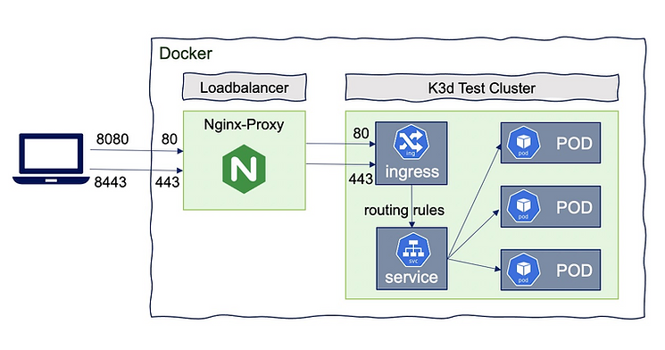

# Kotlin, DevOps e Cloud Native - Alura

Projeto de estudo do curso de Kotlin CloudNative da Alura.

## Curso

- [Aprofunde em Kotlin e DevOps com uma aplicação Cloud Native](https://cursos.alura.com.br/formacao-cloud-native-kotlin)

## Tópicos abordados

- Retrofit
- Circuit Breaker
- Coroutines
- Testes com Kotest
- Kubernetes

## Rodando o projeto

Adicionei um arquivo `docker-compose.yml` para facilitar a execução do projeto. Para rodar o projeto, basta executar o
comando abaixo:

```bash
docker-compose up -d
```

## Levando a imagem para o Docker Hub

Para levar a imagem para o Docker Hub, basta executar o comando abaixo:

```bash
docker image build -t car-service:v2 .
docker tag sha256:f488aaf7d893d89c93955a4e14ff82370cdae1cdd25502ac14c982636db3fdbb jjeanjacques10/car-service:v2
docker push jjeanjacques10/car-service:v2
```

> Resultado: https://hub.docker.com/repository/docker/jjeanjacques10/car-service/

## Kubernetes

Principais comandos utilizados no curso



### Cluster

```bash
# Iniciando o cluster
.\k3d-windows-amd64.exe cluster create --port 8080:80@loadbalancer

# Listando os clusters
.\k3d-windows-amd64.exe cluster list
```

### Kubectl

```bash
#  Aplicando o deployment
kubectl apply -f <nome-pasta>

# Listando os pods
kubectl get pods
````

## Referências

- [Resilience4J](https://resilience4j.readme.io/docs)
- [Kotlin Coroutines](https://kotlinlang.org/docs/coroutines-basics.html)
- [K3D](https://k3d.io/v5.4.6/)
- [K8s Concept and Kubernetes Architecture Tutorials for Beginner](https://manoj777.medium.com/k8s-concept-and-and-kubernetes-architecture-tutorials-for-beginner-6b74c9b0da43)

## Notas

- Para adicionar as Coroutines precisa importar a dependência `kotlinx-coroutines-core` e `kotlinx-coroutines-jdk8`

---
Desenvolvido por [Jean Jacques Barros](https://github.com/jjeanjacques10)